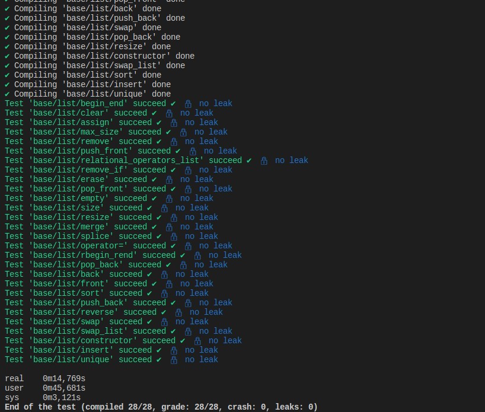

# ft_containers tester

## Installation

Go into your project folder and type:
```bash
git clone https://github.com/lsarrazi/ft_containers_tester.git tester && cd tester
```

### Base Test + Installation

```bash
git clone https://github.com/lsarrazi/ft_containers_tester.git tester && cd tester && ./test.sh base/*/*
```

## Usage

Run all base tests
```bash
./test.sh base/*/*
```

Run all base tests + all bonus tests
```bash
./test.sh base/*/* bonus/*/*
```

Run specific container only
```bash
./test.sh base/list/*
```

Run specific test only
```bash
./test.sh base/list/constructor
```
### Debug mode
Run debug mode (specific test only)
```bash
./test.sh debug base/list/constructor
```


Welcome to lsarrazi's tester for ft_containers
Each test is executed independently of the others in its own executable.
You will find the test logs in the respective folders of each test.
For example "./tests/map/begin".
You will find the following files:
- log.txt: The compilation logs
- expected.txt: The output that your library should produce to succeed the test
- out.txt: The actual output that your library produce
- diff.txt: The difference between expected.txt and output.txt
- valgrind.txt: The output of valgrind

